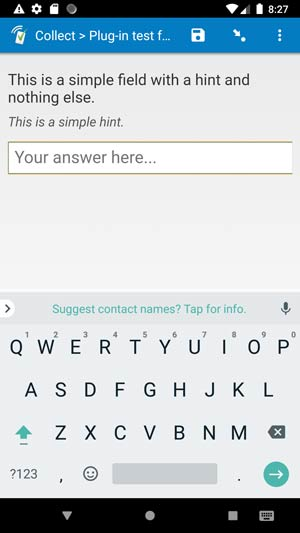

# Chatbot Demo Field Plugin



## Description

An interactive chatbot field plugin that integrates with OpenAI's API to provide conversational AI capabilities within SurveyCTO forms. This plugin allows users to have natural language conversations with an AI assistant and saves the conversation data for analysis.

[](https://github.com/surveycto/chatbot-demo/raw/master/chatbot-demo.fieldplugin.zip)

### Features

This field plug-in offers the following functionality:

1. **OpenAI Integration** Connects to OpenAI's API to provide intelligent conversational responses using configurable models (default: gpt-3.5-turbo).

2. **Multi-language Support** Supports conversations in multiple languages with automatic language detection and preference handling.

3. **Conversation Management** <br>

   - Send messages to the AI assistant
   - Clear conversation history
   - Complete and save conversation data
   - Loading indicators for API calls

4. **Cross-platform Compatibility** Works across SurveyCTO's web, Android, and iOS data collection platforms.

5. **Configurable System Messages** Customize the AI assistant's behavior and language handling through system message parameters.

### Data format

This field plug-in requires the `text` field type and saves the complete conversation history as JSON data.

## How to use

### Getting started

**To use this plug-in**, download the plugin file, configure the required parameters, and attach it to your form with the appropriate field appearance.

### Parameters

| Parameter key    | Parameter value                 | Description                                                    |
| ---------------- | ------------------------------- | -------------------------------------------------------------- |
| `api-key`        | Your OpenAI API key             | **Required** - Get from OpenAI platform                        |
| `model`          | OpenAI model name               | Optional - Defaults to 'gpt-3.5-turbo'                         |
| `language`       | Language preference             | Optional - Defaults to 'English'                               |
| `system-message` | Custom system prompt            | Optional - Overrides default language flow system message      |
| `prompts`        | Suggested conversation starters | Optional - Pipe-separated list of suggested prompts to display |

### Setup Instructions

1. **Get OpenAI API Key**

   - Sign up at [OpenAI](https://platform.openai.com/)
   - Generate an API key from your account settings

2. **Configure Form**

   - Add a `text` field to your form
   - Set the appearance to use this plugin
   - Add the required `api-key` parameter
   - Optionally configure `model`, `language`, and `system-message` parameters

3. **Deploy**
   - Upload the form to your SurveyCTO server
   - Attach the field plugin file
   - Test the conversation functionality

### Example Field Configuration

```
custom-chatbot-demo(api-key=your_openai_api_key_here;model=gpt-4;language=English)

```

### Default SurveyCTO feature support

| Feature / Property      | Support                               |
| ----------------------- | ------------------------------------- |
| Supported field type(s) | `text`                                |
| Default values          | Yes _(loads previous conversation)_   |
| Constraint message      | Uses default behavior                 |
| Required message        | Uses default behavior                 |
| Read only               | Yes _(displays conversation history)_ |
| media:image             | Yes                                   |
| media:audio             | Yes                                   |
| media:video             | Yes                                   |

## Security Considerations

- Store API keys securely and avoid exposing them in form definitions
- Consider data privacy implications when sending conversation data to OpenAI
- Review OpenAI's data usage policies for your use case
- Test thoroughly before deploying in production

## More resources

- **Test form**  
  This form will help you explore the chatbot functionality and test different configurations.  
  [Download test form package](extras/test-form/test-form-package.zip)  
  [Instructions for test form](extras/test-form/README.md)

- **Developer documentation**  
  Instructions and resources for developing your own field plug-ins.  
  [https://github.com/surveycto/Field-plug-in-resources](https://github.com/surveycto/Field-plug-in-resources)

- **User documentation**  
  How to get started using field plug-ins in your SurveyCTO form.  
  [https://docs.surveycto.com/02-designing-forms/03-advanced-topics/06.using-field-plug-ins.html](https://docs.surveycto.com/02-designing-forms/03-advanced-topics/06.using-field-plug-ins.html)

- **OpenAI API Documentation**  
  [https://platform.openai.com/docs](https://platform.openai.com/docs)
