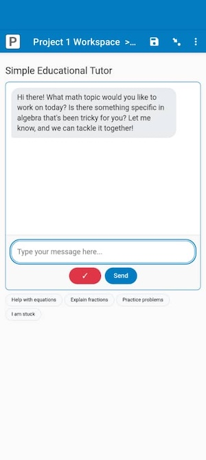

# LLM Conversations



## Description

A flexible conversational AI field plug-in that integrates with multiple AI providers (OpenAI, Google Gemini, and Anthropic Claude) to provide customizable chatbot interactions within SurveyCTO forms. This plug-in is completely prompt-driven and can adapt to any business case or workflow based on the system prompt provided.

**New in v1.1.0:** Multi-provider support with proxy server capability for web deployment. See [PROXY-SETUP.md](docs/PROXY-SETUP.md) for detailed setup instructions.

[](https://github.com/surveycto/llm-conversations/raw/refs/heads/main/llm-conversations.fieldplugin.zip)

### Features

This field plug-in offers comprehensive conversational AI capabilities:

1. **Multi-Provider Support (New in v1.1.0)**  
   Choose between OpenAI, Google Gemini, and Anthropic Claude. Optional proxy server support enables web deployment and bypasses CORS restrictions.

2. **Completely Flexible and Prompt-Driven**  
   Adapts to any business case, workflow, or conversational scenario based on the system prompt provided. No hardcoded business logic.

3. **Dual-Parameter System**  
   Supports both `system_prompt` (core instructions) and `case_data` (specific context/scenarios) parameters for organized prompt management.

4. **Flexible End Code Detection**  
   Automatically detects conversation completion codes (`5j3k`, `x7y8`, `END_CONVERSATION`, etc.) with flexible pattern matching.

5. **Advanced Conversation Management**  
   Save conversation transcripts, clear conversations, mark completion, with customizable end messages and warnings.

6. **Timeout and Session Management**  
   Configurable session timeouts with automatic locking, input preservation, and timeout state persistence.

7. **Customizable Conversation Starters**  
   Control how conversations begin with the `conversation-starter` parameter.

8. **Suggested Prompts Support**  
   Configurable prompt buttons for common questions or actions relevant to your use case.

9. **Multi-Language Support**  
   Works with any language supported by the selected AI provider when configured in the system prompt.

10. **Role-Based Interactions**  
    Supports role-switching and character-based conversations when specified in the system prompt.

11. **Robust Error Handling**  
    Graceful handling of API errors, network issues, and conversation state problems.

### Conversation Workflow

The field plug-in follows a completely flexible workflow determined by your system prompt:

**Generic Flow:**

1. **Initialization** - AI generates opening message based on system prompt and conversation starter
2. **Interactive Exchange** - User and AI exchange messages according to prompt instructions
3. **Completion Detection** - Plug-in detects end codes or completion signals from AI responses
4. **Conversation Conclusion** - Session ends with customizable completion message

**Example Use Cases:**

- **Medical Interviews**: Standardized patient simulations with structured phases
- **Customer Service**: Support conversations with escalation workflows
- **Research Interviews**: Structured data collection with follow-up questions
- **Training Simulations**: Role-playing scenarios for skill development
- **Educational Conversations**: Tutoring or Q&A sessions with adaptive responses

### Data Format

This field plug-in requires the `text` field type and saves the complete conversation transcript as JSON data including all user inputs, AI responses, and system messages.

## How to use

### Getting started

**To use this plug-in**, download the plug-in file, configure the required parameters, and attach it to your form with the appropriate field appearance.

### Required Parameters

| Parameter key   | Parameter value      | Description                                          |
| --------------- | -------------------- | ---------------------------------------------------- |
| `system_prompt` | Core AI instructions | **Required** - Main behavioral guidelines for the AI |
| `api-key`       | Your API key  | **Required*** - API key for your chosen provider (OpenAI, Gemini, or Anthropic) |

\* **Note:** The `api-key` parameter is optional when using a `proxy-url`. API keys can be securely stored in the proxy server's environment variables instead. See [PROXY-SETUP.md](docs/PROXY-SETUP.md) for details.

### Optional Parameters

| Parameter key           | Parameter value              | Description                                                                                               |
| ----------------------- | ---------------------------- | --------------------------------------------------------------------------------------------------------- |
| `provider`              | AI provider name             | Optional - `openai`, `gemini`, or `anthropic` (default: `openai`)                                         |
| `proxy-url`             | Proxy server URL             | Optional* - URL of proxy server for CORS and multi-provider support (see [PROXY-SETUP.md](docs/PROXY-SETUP.md)) |
| `case_data`             | Specific scenario context    | Optional - Additional context, scenarios, or structured data (combined with system_prompt)                |
| `conversation-starter`  | Initial conversation trigger | Optional - Custom message to start conversations (default: "Please begin the conversation as instructed") |
| `model`                 | Model name                   | Optional - Defaults vary by provider (OpenAI: `gpt-4o-mini`, Gemini: `gemini-2.5-flash`, Anthropic: `claude-haiku-4-5-20251001`) |
| `timeout`               | Seconds (integer)            | Optional - Auto-lock after inactivity (default: 600 seconds/10 minutes, set to 0 to disable)              |
| `suggested-prompts`     | Pipe-separated prompt list   | Optional - Custom buttons (e.g., "Ask about symptoms\|Schedule follow-up\|End conversation")              |
| `end-message`           | Custom completion message    | Optional - Personalized conversation conclusion                                                           |
| `clear-button-label`    | Button text                  | Optional - If provided, shows clear button with this label                                                |
| `complete-button-label` | Button text                  | Optional - Label for complete button (defaults to ✓)                                                      |
| `clear-warning-text`    | Warning message              | Optional - Custom warning when clearing conversation                                                      |
| `complete-warning-text` | Warning message              | Optional - Custom warning when completing conversation                                                    |
| `send-button-label`     | Button text                  | Optional - Label for send button (defaults to "Send")                                                     |

\* Required for Gemini and Anthropic providers; optional for OpenAI (recommended for Web Collect)

### Connection and Performance Parameters

| Parameter key        | Parameter value    | Description                                                                    |
| -------------------- | ------------------ | ------------------------------------------------------------------------------ |
| `request-timeout`    | Milliseconds       | Optional - Initial connection timeout (default: 30000ms/30s)                   |
| `stream-timeout`     | Milliseconds       | Optional - Time between stream chunks (default: 15000ms/15s)                   |
| `stream-max-wait`    | Milliseconds       | Optional - Maximum total stream time (default: 60000ms/60s)                    |
| `max-retries`        | Integer            | Optional - Number of retry attempts (default: 3)                               |
| `retry-delay`        | Milliseconds       | Optional - Base delay between retries (default: 2000ms/2s, uses exponential backoff) |
| `streaming-fallback` | true/false         | Optional - Enable fallback to non-streaming (default: true)                    |

### Setup Instructions

1. **Get API Key**
   - **OpenAI**: Sign up at [platform.openai.com](https://platform.openai.com/) and generate an API key
   - **Gemini**: Visit [aistudio.google.com/app/apikey](https://aistudio.google.com/app/apikey) to create a key
   - **Anthropic**: Sign up at [console.anthropic.com](https://console.anthropic.com) and create an API key

2. **(Optional) Set Up Proxy Server**
   - Required for Gemini and Anthropic
   - Recommended for OpenAI when using Web Collect
   - See [PROXY-SETUP.md](docs/PROXY-SETUP.md) for detailed setup instructions

3. **Configure Form**
   - Add a `text` field to your form
   - Set the appearance to use this plug-in
   - Add the required `api-key` and `system_prompt` parameters
   - Optionally configure `provider`, `proxy-url`, `model`, `case_data`, etc.

4. **Deploy**
   - Upload the form to your SurveyCTO server
   - Attach the field plug-in file
   - Test the conversation functionality

### Example Field Configuration

**OpenAI (Direct Connection in Collect):**
```
custom-llm-conversations(
    provider=openai,
    api-key=your_openai_api_key_here,
    model=gpt-4o-mini,
    system_prompt="You are a standardized patient for medical training. Follow these guidelines...",
    case_data="Patient: Angela, 24-year-old female with breathing difficulties...",
    conversation-starter="Please begin as the nurse introducing the patient",
    timeout=600,
    suggested-prompts='Tell me about your symptoms|When did this start?|Any family history?|Let me examine you',
    end-message='Thank you for completing this medical consultation.'
)
```

**With Proxy Server (Required for Web Collect & Gemini/Anthropic):**

*Option A: With API key in form parameter*
```
custom-llm-conversations(
    provider=gemini,
    api-key=your_gemini_api_key_here,
    proxy-url=https://your-worker.workers.dev,
    model=gemini-pro,
    system_prompt="You are a standardized patient for medical training. Follow these guidelines...",
    case_data="Patient: Angela, 24-year-old female with breathing difficulties...",
    conversation-starter="Please begin as the nurse introducing the patient",
    timeout=600,
    suggested-prompts='Tell me about your symptoms|When did this start?|Any family history?|Let me examine you',
    end-message='Thank you for completing this medical consultation.'
)
```

*Option B: With API key stored in proxy server (more secure)*
```
custom-llm-conversations(
    provider=gemini,
    proxy-url=https://your-worker.workers.dev,
    model=gemini-pro,
    system_prompt="You are a standardized patient for medical training. Follow these guidelines...",
    case_data="Patient: Angela, 24-year-old female with breathing difficulties...",
    conversation-starter="Please begin as the nurse introducing the patient",
    timeout=600,
    suggested-prompts='Tell me about your symptoms|When did this start?|Any family history?|Let me examine you',
    end-message='Thank you for completing this medical consultation.'
)
```

See [PROXY-SETUP.md](docs/PROXY-SETUP.md) for detailed proxy server setup instructions.

### Session Management

**Timeout Behavior:**

- Sessions automatically lock after configured inactivity period (default: 10 minutes)
- Timeout can be customized or disabled via the `timeout` parameter
- Inactivity timer pauses when page is not visible
- Timeout state persists across form navigation
- Clear button resets timeout state

**Connection Resilience:**

- Automatic retry with exponential backoff for failed requests
- Configurable timeouts for different connection phases
- Streaming fallback for unreliable connections
- Preserved user input on connection failures
- Clean error recovery without page reloads

**Input Preservation:**

- Typed but unsubmitted text is automatically saved
- Input is restored when returning to the field
- Cleared when message is successfully sent
- Cleared when conversation is cleared

**End Code Detection:**
The plug-in automatically detects various conversation completion patterns:

- Standalone codes: `5j3k`, `x7y8`, `END_CONVERSATION`, `TERMINATE`, `COMPLETE`
- Codes in text: "Thank you. Code escape: 5j3k"
- Flexible pattern matching for custom end signals

### Default SurveyCTO feature support

| Feature / Property      | Support                               |
| ----------------------- | ------------------------------------- |
| Supported field type(s) | `text`                                |
| Default values          | Yes _(loads previous conversation)_   |
| Constraint message      | Uses default behavior                 |
| Required message        | Uses default behavior                 |
| Read only               | Yes _(displays conversation history)_ |
| media:image             | Yes                                   |
| media:audio             | Yes                                   |
| media:video             | Yes                                   |

## Security Considerations

- **API Key Protection (Recommended)**: For production deployments, use a proxy server with API keys stored as environment variables. This keeps keys completely out of form definitions and centralizes key management. See [PROXY-SETUP.md](docs/PROXY-SETUP.md) for setup instructions.
- **Alternative**: For testing or small deployments, you can provide API keys directly in field parameters, but use key rotation and rate limits
- **Data Privacy**: Consider data privacy implications when sending conversation data to AI providers
- **Usage Policies**: Review each provider's data usage policies:
  - [OpenAI Usage Policies](https://openai.com/policies/usage-policies)
  - [Google Gemini Terms](https://ai.google.dev/terms)
  - [Anthropic Usage Policy](https://www.anthropic.com/legal/aup)
- **Rate Limiting**: Set up usage alerts and spending limits on your API accounts
- **HTTPS Only**: Always use HTTPS URLs for proxy servers

## Best Practices

### System Prompt Design

- Be specific and explicit about desired behavior
- Include error handling instructions
- Define clear conversation flow rules
- Use examples to illustrate expected responses
- Test with various input scenarios

### Performance Optimization

- Keep system prompts concise but comprehensive
- Use appropriate OpenAI model for your use case
- Monitor token usage and costs
- Implement reasonable conversation length limits

### User Experience

- Provide clear instructions to users
- Use suggested prompts for common actions
- Set appropriate timeout values for your use case
- Test on various devices and screen sizes
- Consider offline scenarios and error states

### Connection Optimization

- Adjust timeout parameters based on your typical network conditions
- Use higher retry counts for unreliable connections
- Enable streaming fallback for better reliability
- Monitor error patterns and adjust parameters accordingly

## Troubleshooting
### Common Connection Issues

**"Connection interrupted" errors:**
- Increase `stream-timeout` and `stream-max-wait` parameters
- Enable `streaming-fallback` if not already enabled
- Check network stability

**"Request timed out" errors:**
- Increase `request-timeout` parameter
- Increase `max-retries` for unreliable connections
- Consider using a more stable network connection

**Frequent retry attempts:**
- Check API key validity
- Verify OpenAI service status
- Adjust `retry-delay` to reduce server load

## Testing the Plug-in

To test the plug-in:

1. **Basic Test Configuration**
   ```
   custom-llm-conversations(
       api-key=your_openai_api_key_here,
       model=gpt-4o-mini,
       system_prompt="You are a helpful assistant. Always end responses with the code '5j3k' when the conversation should end.",
       conversation-starter="Hello! How can I help you today?",
       suggested-prompts="What can you do?|Tell me a joke|Help me with math|End conversation"
   )
   ```

2. **Testing Checklist**
   - ✅ Conversation starts properly
   - ✅ AI responds appropriately to prompts
   - ✅ Streaming works (real-time text display)
   - ✅ End codes are detected (test with "Please end the conversation")
   - ✅ Error handling works (test with invalid API key)
   - ✅ Button layout works (Send button rightmost, Complete button is red)

## More resources

- **Proxy Server Setup Guide**  
  Complete guide for setting up multi-provider support with Cloudflare Workers proxy.  
  [PROXY-SETUP.md](docs/PROXY-SETUP.md)

- **Test form**  
  This form will help you explore the chatbot functionality and test different configurations.  
  [Download test form](https://github.com/surveycto/llm-conversations/blob/main/extras/test-form/plugin_test_form_text.xlsx)  

- **Developer documentation**  
  Instructions and resources for developing your own field plug-ins.  
  [https://github.com/surveycto/Field-plug-in-resources](https://github.com/surveycto/Field-plug-in-resources)

- **User documentation**  
  How to get started using field plug-ins in your SurveyCTO form.  
  [https://docs.surveycto.com/02-designing-forms/03-advanced-topics/06.using-field-plug-ins.html](https://docs.surveycto.com/02-designing-forms/03-advanced-topics/06.using-field-plug-ins.html)

- **AI Provider Documentation**  
  - [OpenAI API Documentation](https://platform.openai.com/docs)
  - [Google Gemini API Documentation](https://ai.google.dev/docs)
  - [Anthropic Claude API Documentation](https://docs.anthropic.com)

## Acknowledgments

This plug-in was developed with collaboration and support from Benjamin Daniels and Stella Zhang of the Global Health and Population department at the Harvard T.H. Chan School of Public Health.

## Platform Compatibility

### Android Support
**Recommended: Android 9.0+ (API 28 and above)**

The chatbot plug-in uses modern JavaScript features including async/await, AbortController, and streaming fetch APIs. While these features may work on some Android 8.1+ devices with updated WebView, Android 9.0+ provides guaranteed compatibility and reliable performance.

For maximum compatibility across all devices in your deployment:
- **Android 9.0+**: Full native support, no issues expected
- **Android 8.1+**: May work with updated Chrome WebView (not guaranteed)
- **Android 8.0 and below**: Not recommended, requires significant code modifications

If you need to support older Android versions, consider implementing the compatibility fallbacks mentioned in the troubleshooting section.
